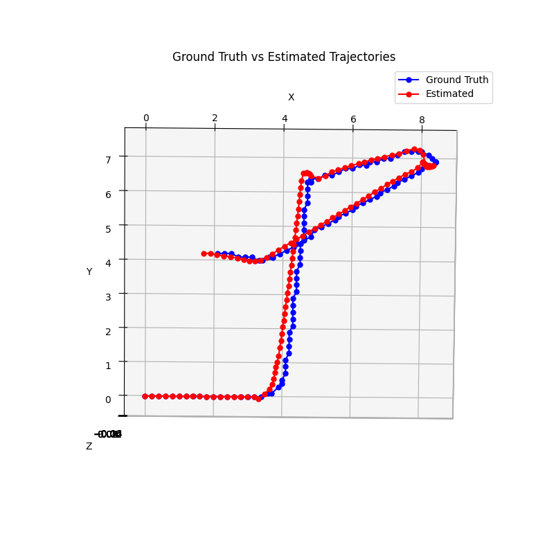
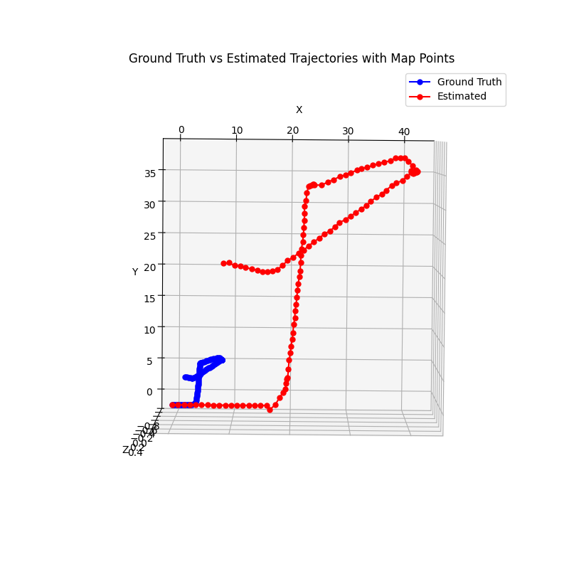
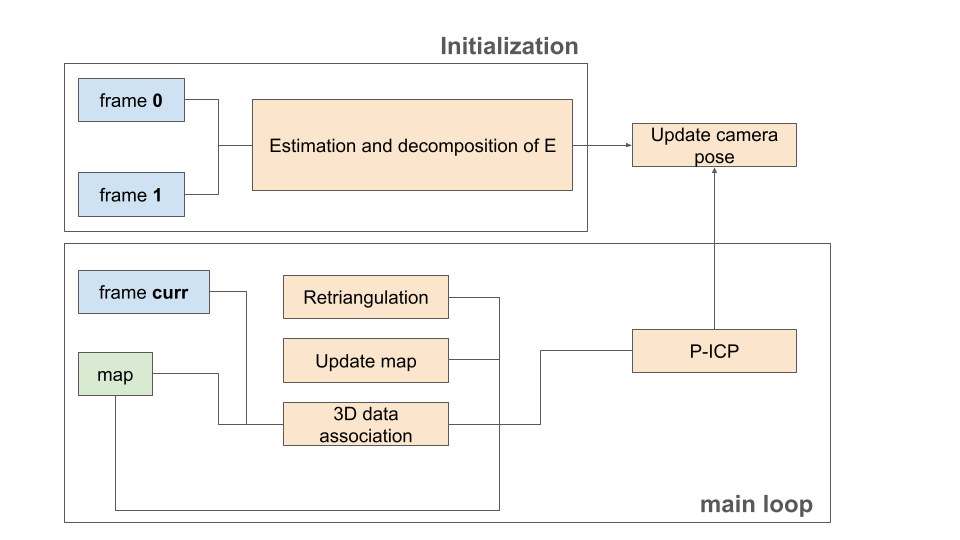

# Monocular Visual Odometry

This repository contains an implementation of a **Monocular Visual Odometry** system, which estimates the trajectory of a moving camera using monocular images.
## Overview 
**Visual Odometry (VO)** is a technique that estimates the position and orientation of a camera in a three-dimensional environment by analyzing changes in captured images over time. VO is extensively used in robotics, autonomous vehicles, and augmented/virtual reality (AR/VR). In autonomous vehicles, VO helps estimate motion when GPS signals are unavailable or unreliable. In robotics, it is crucial for navigation in unknown environments, enabling robots to move and localize themselves without external references. In AR/VR, VO enhances motion tracking and ensures smooth and accurate rendering of virtual objects in real-world scenes.

## Results
<p align="center">
  
  
</p>

One of the fundamental limitations of **Monocular Visual Odometry (VO)** is its inability to recover the absolute scale of motion. Since monocular VO relies solely on image sequences to estimate the camera’s movement, it can only determine the relative motion between frames, but not the actual metric scale of the trajectory. As a result, the estimated trajectory is **out of scale**, meaning that while the shape and orientation of the motion may be accurate, the absolute distances are unknown or incorrectly scaled.

#### Addressing the Scale Issue

Several methods exist to mitigate this problem:

- **External Sensors (IMU, GPS, LiDAR)**: Combining monocular VO with an **Inertial Measurement Unit (IMU)** provides additional motion constraints that help infer scale. GPS can also be used to obtain absolute position data. Similarly, **LiDAR sensors** can provide depth measurements, allowing for accurate scale estimation.
  
- **Stereo or Depth Cameras**: Unlike monocular VO, **stereo VO** uses two cameras with a known baseline distance, allowing it to directly estimate depth information and resolve the scale ambiguity. Alternatively, **RGB-D cameras** provide depth maps, which can also be used to obtain metric scale.

- **Scene-based Assumptions**: In some cases, the scale can be estimated by recognizing known objects (such as pedestrians, cars, or buildings) and using their real-world dimensions as reference points.

The two images illustrate the scale problem in monocular VO: 
- **Left Image**: This shows a comparison between the **estimated trajectory** (obtained from VO) and the **ground truth** (actual trajectory) with the scaled estimated trajectory by compute a ratio in this form: 

$$
\text{ratio} = \text{median} \left( \frac{ \|\hat{T}\| }{ \|T\| } \right)
$$


- **Right Image**: This is the **actual estimated trajectory** obtained using monocular VO. As can be seen, the trajectory is correctly shaped but has no meaningful scale, demonstrating the limitation we described.

This issue is particularly relevant in real-world applications where absolute positioning is necessary, such as autonomous driving and drone navigation. In these cases, monocular VO alone is insufficient, and external measurements must be incorporated to achieve reliable navigation.

## Method



The method is divided into two phases:
1. **Initialization Phase:**
This phase takes the first two consecutive frames as input. Using data association, it calculates the essential matrix, decomposes it, and selects the solution with the largest number of triangulated points in front of the camera.
2. **Main Loop**:
The main loop takes the current frame and the map, associates the 3D points with the measurements from the current frame, and passes everything to P-ICP. It calculates the homogeneous transformation that aligns the camera pose with the current frame and updates the estimate. A sub-loop is responsible for re-triangulating all points in the map, considering all the measurements observed up to that point. It also updates the map by triangulating new, unseen points.

**P-ICP**:
P-ICP (Point-to-Plane Iterative Closest Point) is a variant of the classic ICP algorithm. It aims to minimize the distance between 3D points in the map and their corresponding points in the current frame, by aligning the points through point-to-plane correspondence, as opposed to point-to-point. 

**Data Association (2D and 3D)**: Data association between two frames refers to the challenge of correctly matching features or points detected in the second frame to those in the first frame. In this work the DA its perform by compute the similarity between points and associate the couple with the largest value. In case of 3D association, we project all points into the image plane and used the same method. 

**Re-triangulation**: The re-triangulation function implement the DLT method: is an algorithm which solves a set of variables from a set of similarity relations. In our case, we have a set of absolute pose and a set of measurements for every point in the map (for each frame). See the code for more details. 

**Update the map**: This function take the measurements of the current frame and triangulate with the measure of the previous the points that are not already in the map. After that, extend it. 

## Requirements
To run this project, ensure you have the following dependencies installed:
- Numpy
- Matplotlib
- OpenCV
- Scipy
- Pandas

## Installation
1. Clone the repository:
```bash
git clone git@github.com:FrancescoSpena/Visual-Odometry.git
```
2. Navigate into the folder:
```bash
cd Visual-Odometry/
```
3. Install the requirements:
```bash
pip install -r requirements.txt
```
## Usage
1. Navigate into the folder src:
```bash
cd Visual-Odometry/src/
```
2. Run the following command:
```bash
python3 main.py --picp num_iter_picp --iter num_frame --plot bool
```

Options:
1. **picp**: Number of iterations for P-ICP (*Required*)
2. **iter**: Number of frames, max 120 (*Required*)
3. **plot**: Enable the plot (bool)


